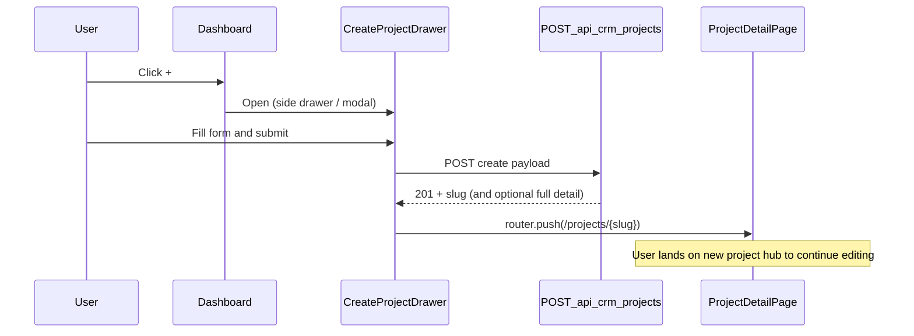
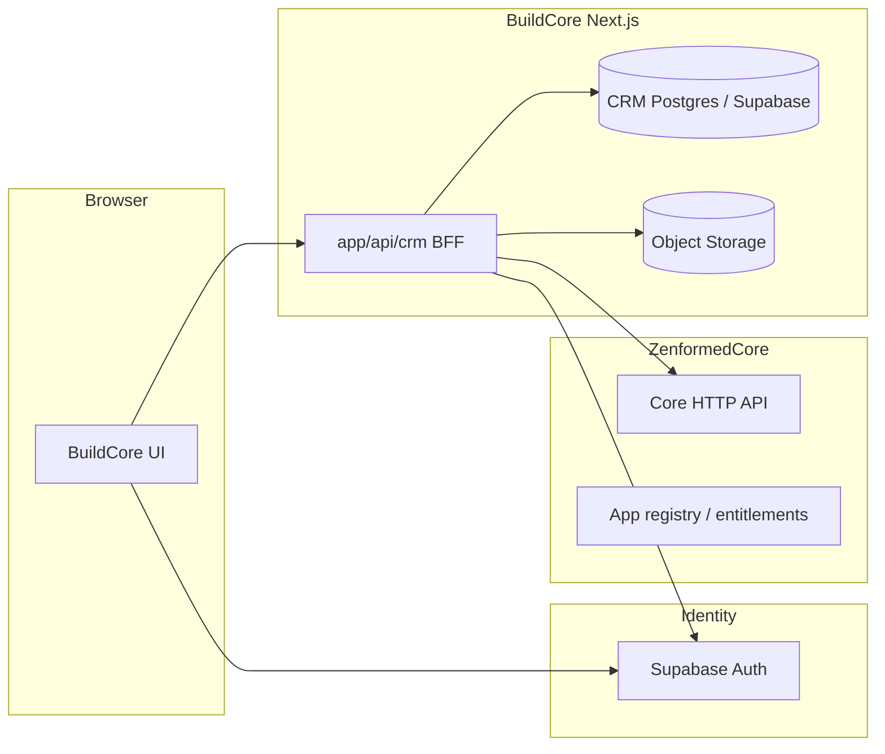

# BuildCore CRM — Backend Plan (Phase 5)

**Status:** Phase 7A schema migrations live under `BuildCore/supabase/migrations/`. API routes and UI data-source swap are not implemented yet.

**Source of truth today:** `src/domain/crm/*` types and `src/platform/mock/crm/*` fixtures. This document maps those shapes to a future persistence and BFF layer.

**Last updated:** 2026-05-16 (navigation / CRUD / task-documents revision)

**Related:** UI phase checklist in [PROGRESS.md](./PROGRESS.md) §5 and §8.

---

## 1. Goals and constraints

| Goal | Notes |
|------|--------|
| Replace mock provider with API-backed provider | UI continues to consume domain types via hooks + application ports |
| Multi-tenant CRM | Every row scoped to an organization (tenant) |
| Align with existing BFF pattern | Browser → BuildCore `app/api/*` → data layer (not direct Supabase from browser for CRM) |
| Defer workflow engine complexity | Start with read-only list/detail; mutations phased |

**Out of scope for first backend slice:** configurable kanban columns, payments processor integration, full document binary pipeline, cross-app CRM APIs on ZenformedCore.

**Explicitly out of scope (UI):** inline editing in the main projects table; row click remains navigation-only.

---

## 1.1 UI navigation and CRUD (planned behavior)

This section aligns backend work with **current and intended** frontend flows. No UI implementation in this phase.

### Dashboard (`/dashboard` — projects table)

| Interaction | Behavior | Backend (future) |
|-------------|----------|------------------|
| **Search / stage / priority filters** | Client-side today; server-side when API exists | `GET /api/crm/projects?search=&stage=&priority=` |
| **Row click** | **Unchanged:** navigate to `/projects/{slug}` (existing detail route). Not an edit affordance. | `GET /api/crm/projects/:slug` |
| **`+` button** (header, beside search) | **Planned:** open ForgeCore-style **side drawer or modal** for create. Today: dev placeholder (`console.info`). | `POST /api/crm/projects` on submit |

**Not planned for the table:** inline cell editing, double-click-to-edit, or expand-row editors. The table is a **read-only pipeline index** plus navigation.

### Create flow (`+` → drawer → detail)



**Drawer fields (v1 create form):**

| Field | Maps to | Notes |
|-------|---------|--------|
| Customer / project name | `crm_projects.name` (+ often `crm_clients.name` on create) | Required |
| Contact name | `crm_contacts.name` | |
| Email | `crm_contacts.email` | |
| Phone | `crm_contacts.phone` | |
| Priority | `crm_projects.priority` | `CrmPriority` |
| Current stage | `crm_projects.current_stage_slug` | Default e.g. `new-lead` |
| Waiting on | `crm_projects.waiting_on` | |
| Notes | `crm_projects.notes` | |
| Deal value | `crm_projects.deal_value_cents` | Currency input → cents |
| Balance | `crm_projects.balance_remaining_cents` | Often equals deal value at create |
| Assigned team member | `crm_projects.assigned_user_id` | Org member picker |
| Last updated | `crm_projects.last_updated_at` | **System-managed** on create/update; not user-editable in drawer |

Optional on create (server defaults): `trade_type`, initial workflow tasks from template, empty milestone scaffold.

**Post-create navigation:** On **201 Created**, client navigates to `/projects/{slug}` (same as row click). Do not return user to table-only state.

**UI placement:** Reuse patterns from ForgeCore settings drawer / modal chrome (`BuildCoreSettingsDrawer`, `@zenformed/core` shell primitives)—new component e.g. `CreateCrmProjectDrawer` under `presentation/components/CrmProjects/`.

### Detail page (`/projects/[slug]` — primary editing surface)

| Area | Role | Edit (future) |
|------|------|----------------|
| Header | Back, title, priority/stage pills | Read-only title context; pills reflect saved state |
| Next step | `waiting_on` prominence | Editable field |
| Contact & project card | Client, contact, assignee, notes | Field-level edit where displayed |
| Deal & payments | Deal value, balance, invoiced/paid, milestones | Editable financial fields + milestone rows |
| Pipeline progress | Stage bar + chips | Stage advance / completion (controlled) |
| **Workflow tasks** | Task list; **primary workflow execution UI** | Task status, assignee, due; **documents attach here** |
| **Documents (bottom)** | **Aggregate index** of all task-attached docs | Links to task context; upload entry from task row first |
| Accountability | Audit feed | Read-only; events from server on mutations |

**Editing rule:** Users edit **on the detail page** in context (cards, task rows, milestone rows). No requirement to return to the table to save.

**Navigation:** Back button → `/dashboard` (unchanged).

---

## 1.2 Workflow tasks and documents (product model)

### Current mock shape (today)

- `CrmWorkflowTask` — no `documents` array yet (`src/domain/crm/workflowTask.ts`).
- `CrmDocumentMetadata` — `stageSlug` optional; **no `workflowTaskId`** yet (`src/domain/crm/document.ts`).
- Detail UI: documents in a separate bottom panel; workflow table has no Documents column.

### Target model (backend + future domain)

**Documents attach primarily to workflow tasks.** Stage slug remains useful metadata (denormalized from task or set on upload) but **canonical FK is `workflow_task_id`.**

| UI surface | Purpose |
|----------|---------|
| **Workflow table** | Columns e.g. Task \| Stage \| Status \| **Documents** \| Due — cell shows count, primary filename, or “N/A” |
| **Documents panel (bottom)** | Read-only **aggregate / index** across all tasks for the project; filter/sort; jump to task |

Example row (planned):

| Task | Stage | Status | Documents | Due |
|------|-------|--------|-------------|-----|
| Site Walk | Scheduled | In Progress | Site photos.zip | May 20, 2025 |
| Prepare Estimate | Estimate Sent | Pending | N/A | May 20, 2025 |

### Planned domain extensions (when implementing — not in this doc phase)

```ts
// Future — illustrative only
type CrmWorkflowTask = {
  // ...existing fields
  readonly documentSummary: string | null; // e.g. "Site photos.zip" or "3 files"
  readonly documentCount: number;
};

type CrmDocumentMetadata = {
  // ...existing fields
  readonly workflowTaskId: string;
  readonly stageSlug: PipelineStageSlug | null; // denormalized
};
```

`CrmProjectDetail.documents` remains the **aggregate list** returned by `GET /api/crm/projects/:slug` (or a dedicated sub-query) for the bottom panel.

---

## 2. Proposed database tables

All CRM tables live in **BuildCore’s app database** (Supabase Postgres project used by BuildCore, or equivalent), with `organization_id` (UUID, matches ZenformedCore org / JWT `tenant_id`) on every tenant-owned row.

Naming convention: `crm_*` prefix to avoid collisions with auth/profile tables.

### 2.1 Core entities

#### `crm_clients`

| Column | Type | Notes |
|--------|------|--------|
| `id` | `uuid` PK | |
| `organization_id` | `uuid` NOT NULL | RLS key |
| `name` | `text` NOT NULL | Maps to `CrmClient.name` |
| `segment` | `text` NULL | e.g. `multi-family`, `commercial` |
| `created_at` / `updated_at` | `timestamptz` | |

#### `crm_contacts`

| Column | Type | Notes |
|--------|------|--------|
| `id` | `uuid` PK | |
| `organization_id` | `uuid` NOT NULL | |
| `client_id` | `uuid` NULL FK → `crm_clients` | Optional; project may embed primary contact |
| `name` | `text` NOT NULL | |
| `email` | `text` | |
| `phone` | `text` | |
| `title` | `text` NULL | |
| `created_at` / `updated_at` | `timestamptz` | |

#### `crm_projects`

Primary aggregate root for list + detail summary.

| Column | Type | Notes |
|--------|------|--------|
| `id` | `uuid` PK | |
| `organization_id` | `uuid` NOT NULL | |
| `slug` | `text` NOT NULL | Unique per org; maps to `CrmProjectSummary.slug` |
| `name` | `text` NOT NULL | |
| `trade_type` | `text` NOT NULL | Enum-like: `hvac`, `roofing`, … (`CrmTradeType`) |
| `client_id` | `uuid` NOT NULL FK → `crm_clients` | |
| `primary_contact_id` | `uuid` NULL FK → `crm_contacts` | Denormalized convenience |
| `priority` | `text` NOT NULL | `low` \| `normal` \| `high` \| `urgent` |
| `current_stage_slug` | `text` NOT NULL | FK logical ref to stage definition |
| `waiting_on` | `text` NULL | |
| `notes` | `text` NULL | Full notes; `notes_preview` computed in API |
| `deal_value_cents` | `bigint` NOT NULL DEFAULT 0 | |
| `balance_remaining_cents` | `bigint` NOT NULL DEFAULT 0 | May be derived from milestones later |
| `assigned_user_id` | `uuid` NULL | Platform user id (Supabase/Core), not mock `tm-*` |
| `last_updated_at` | `timestamptz` NOT NULL | |
| `created_at` | `timestamptz` NOT NULL | |

**Indexes:** `(organization_id, slug)` unique; `(organization_id, current_stage_slug)`; `(organization_id, last_updated_at DESC)` for list.

### 2.2 Pipeline stages

Two-layer model recommended:

#### `crm_pipeline_stage_definitions` (org-level catalog)

| Column | Type | Notes |
|--------|------|--------|
| `id` | `uuid` PK | |
| `organization_id` | `uuid` NOT NULL | |
| `slug` | `text` NOT NULL | Matches `PipelineStageSlug` where using defaults |
| `label` | `text` NOT NULL | |
| `sort_order` | `int` NOT NULL | 1-based, aligns with `DEFAULT_PIPELINE_STAGES` |
| `is_active` | `boolean` DEFAULT true | Soft-disable without breaking history |
| `created_at` / `updated_at` | `timestamptz` | |

**Seed strategy:** On org onboarding, insert 12 rows from `DEFAULT_PIPELINE_STAGES` in `src/domain/crm/pipelineStage.ts`. Custom stages = open question (§7).

#### `crm_project_stage_progress` (per project)

| Column | Type | Notes |
|--------|------|--------|
| `project_id` | `uuid` PK FK → `crm_projects` | One row per project |
| `organization_id` | `uuid` NOT NULL | |
| `current_stage_slug` | `text` NOT NULL | Redundant with project row; keep in sync via transaction |
| `completed_stage_slugs` | `jsonb` NOT NULL DEFAULT `[]` | `PipelineStageSlug[]`; maps to `CrmStageProgress` |

Alternative: junction table `crm_project_completed_stages (project_id, stage_slug)` — better for querying; more joins. Start with `jsonb` for read-heavy v1.

### 2.3 Workflow tasks

#### `crm_workflow_tasks`

| Column | Type | Notes |
|--------|------|--------|
| `id` | `uuid` PK | |
| `organization_id` | `uuid` NOT NULL | |
| `project_id` | `uuid` NOT NULL FK → `crm_projects` ON DELETE CASCADE | |
| `stage_slug` | `text` NOT NULL | |
| `title` | `text` NOT NULL | |
| `status` | `text` NOT NULL | `pending` \| `in_progress` \| `blocked` \| `done` \| `skipped` |
| `assigned_user_id` | `uuid` NULL | |
| `due_at` | `timestamptz` NULL | |
| `completed_at` | `timestamptz` NULL | |
| `completed_by_user_id` | `uuid` NULL | |
| `sort_order` | `int` NOT NULL | |
| `created_at` / `updated_at` | `timestamptz` | |

### 2.4 Documents (metadata only in v1; task-attached)

#### `crm_documents`

| Column | Type | Notes |
|--------|------|--------|
| `id` | `uuid` PK | |
| `organization_id` | `uuid` NOT NULL | |
| `project_id` | `uuid` NOT NULL FK | Denormalized for aggregate queries |
| `workflow_task_id` | `uuid` NOT NULL FK → `crm_workflow_tasks` | **Primary attachment**; ON DELETE CASCADE or SET NULL per product rule |
| `name` | `text` NOT NULL | |
| `kind` | `text` NOT NULL | `CrmDocumentKind` |
| `stage_slug` | `text` NULL | Denormalized from task.stage_slug at upload time |
| `storage_bucket` | `text` NULL | Supabase Storage bucket name |
| `storage_path` | `text` NULL | Object key; NULL until upload implemented |
| `mime_type` | `text` NOT NULL | |
| `size_bytes` | `bigint` NOT NULL DEFAULT 0 | |
| `uploaded_at` | `timestamptz` NOT NULL | |
| `uploaded_by_user_id` | `uuid` NOT NULL | |
| `reviewed_at` | `timestamptz` NULL | Review workflow (future UI on task or aggregate panel) |
| `reviewed_by_user_id` | `uuid` NULL | |
| `created_at` / `updated_at` | `timestamptz` | |

**Indexes:** `(organization_id, project_id)` for aggregate panel; `(workflow_task_id)` for per-task lists.

**Queries:**

- **Per task:** `WHERE workflow_task_id = :taskId`
- **Project aggregate (bottom Documents section):** `WHERE project_id = :projectId ORDER BY uploaded_at DESC`
- **Workflow table cell:** subquery or join count + “latest filename” per task

Binary files: **Supabase Storage** in app project; path e.g. `{org_id}/projects/{project_id}/tasks/{task_id}/{document_id}/{filename}`. Signed URLs via BFF only.

**Audit:** On upload, review status change, and delete → append `crm_accountability_events` (e.g. “Uploaded Site photos.zip to task Site Walk”).

### 2.5 Accountability / audit log

#### `crm_accountability_events`

| Column | Type | Notes |
|--------|------|--------|
| `id` | `uuid` PK | |
| `organization_id` | `uuid` NOT NULL | |
| `project_id` | `uuid` NOT NULL FK | |
| `actor_user_id` | `uuid` NOT NULL | |
| `action` | `text` NOT NULL | Human-readable line today; later structured `event_type` + `payload` |
| `stage_slug` | `text` NULL | |
| `occurred_at` | `timestamptz` NOT NULL | Maps to `CrmAccountabilityAction.at` |
| `created_at` | `timestamptz` NOT NULL | |

Append-only; no updates. Consider `event_type` + `metadata jsonb` in v2 for analytics.

### 2.6 Milestones / payments

#### `crm_project_payment_summary` (optional 1:1 with project)

| Column | Type | Notes |
|--------|------|--------|
| `project_id` | `uuid` PK FK | |
| `organization_id` | `uuid` NOT NULL | |
| `contract_value_cents` | `bigint` NOT NULL | Often mirrors `deal_value_cents` |
| `invoiced_cents` | `bigint` NOT NULL DEFAULT 0 | |
| `paid_cents` | `bigint` NOT NULL DEFAULT 0 | |
| `balance_cents` | `bigint` NOT NULL | Computed or stored |

#### `crm_milestones`

| Column | Type | Notes |
|--------|------|--------|
| `id` | `uuid` PK | |
| `organization_id` | `uuid` NOT NULL | |
| `project_id` | `uuid` NOT NULL FK | |
| `label` | `text` NOT NULL | |
| `amount_cents` | `bigint` NOT NULL | |
| `due_at` | `timestamptz` NULL | |
| `completed_at` | `timestamptz` NULL | |
| `status` | `text` NOT NULL | `pending` \| `due` \| `paid` \| `waived` |
| `sort_order` | `int` NOT NULL | |
| `created_at` / `updated_at` | `timestamptz` | |

### 2.7 Team members / assignees

**Do not** create a parallel `crm_team_members` user directory long-term.

| Approach | Recommendation |
|----------|----------------|
| **v1** | Resolve `assigned_user_id` / `actor_user_id` to display fields via join to a **read model** built from ZenformedCore org membership + Supabase `auth.users` metadata (or Core user list API when available) |
| **Cache (optional)** | `crm_org_member_cache (organization_id, user_id, display_name, initials, avatar_url, synced_at)` refreshed on login or webhook — maps to `CrmTeamMemberRef` at API boundary |
| **Mock today** | `MOCK_CRM_TEAM_MEMBERS` / `tm-*` ids → replace with real `user_id` UUIDs |

---

## 3. Ownership and platform boundaries



### 3.1 BuildCore app-local (recommended)

| Concern | Owner |
|---------|--------|
| CRM schema and migrations | BuildCore repo (`supabase/migrations` or dedicated CRM migration folder) |
| CRM read/write business rules | BuildCore `src/application` use cases |
| CRM BFF routes | BuildCore `app/api/crm/*` |
| Document object storage | BuildCore Supabase Storage buckets (org-scoped paths) |
| List/detail DTO assembly | BuildCore infrastructure mappers → domain types |

### 3.2 ZenformedCore / shared platform

| Concern | Owner |
|---------|--------|
| User authentication session | Supabase (shared) |
| App entitlement (`buildcore` slug) | ZenformedCore registry |
| Profile relay, onboarding flags | Existing `GET/PATCH /api/internal/users-me-profile` → Core |
| Organization branding | Existing branding relay |
| Org membership, roles (future) | ZenformedCore — **source for assignee picker**, not CRM rows |
| Cross-app capabilities / license tier | ZenformedCore entitlement snapshot (already in UI) |

**Do not** put CRM project/workflow tables on ZenformedCore until a second consuming app needs the same CRM API. ForgeCore is operations/job-board oriented; CRM remains BuildCore-specific for now.

### 3.3 `@zenformed/core` package

| In scope | Out of scope |
|----------|----------------|
| Auth reaction helpers, dashboard shell, generic HTTP/upload utilities | `CrmProjectDetail`, pipeline types, CRM-specific hooks |
| Optional future: generic `createTenantScopedRepository` patterns | CRM table definitions |

---

## 4. Proposed API / BFF routes

All routes require **Bearer token** (Supabase session), resolve `organization_id` from JWT / profile, return **401** if missing. Shapes align with `CrmProjectSummary` and `CrmProjectDetail` — no UI-specific fields.

Base path recommendation: **`/api/crm/`** (distinct from `/api/internal/` Core relays).

### 4.1 Phase 5a — Read-only (first implementation)

| Method | Route | Response | Maps to |
|--------|-------|----------|---------|
| `GET` | `/api/crm/projects` | `{ projects: CrmProjectSummary[], total: number }` | List table; query: `search`, `stage`, `priority`, `limit`, `offset` |
| `GET` | `/api/crm/projects/:slug` | `CrmProjectDetail` or `404` | Detail page |

Server-side filtering mirrors `crmProjectsPipelineViewModel.ts` today; move filter logic into use case when API exists.

### 4.2 Phase 5b — Mutations (later)

| Method | Route | Purpose |
|--------|-------|---------|
| `POST` | `/api/crm/projects` | **Create** from drawer: client + contact + project + default tasks; response includes `slug` for `router.push(/projects/{slug})` |
| `PATCH` | `/api/crm/projects/:id` | **Detail-page edits:** notes, priority, assignee, waiting_on, deal/balance, contact fields; sets `last_updated_at` server-side |
| `PATCH` | `/api/crm/projects/:id/stage` | Advance stage, update `completed_stage_slugs`, append accountability event |
| `PATCH` | `/api/crm/projects/:id/workflow-tasks/:taskId` | Task status / assignee / due date (detail workflow table) |
| `POST` | `/api/crm/projects/:id/workflow-tasks/:taskId/documents` | Register metadata after upload (**task-scoped**) |
| `GET` | `/api/crm/projects/:id/documents` | **Aggregate list** for bottom Documents panel (all tasks) |
| `GET` | `/api/crm/projects/:id/workflow-tasks/:taskId/documents` | Documents for one task (workflow row / task drawer) |
| `GET` | `/api/crm/projects/:id/documents/:docId/download` | Signed URL redirect |
| `PATCH` | `/api/crm/projects/:id/documents/:docId/review` | Mark reviewed / pending (future) |
| `POST` | `/api/crm/projects/:id/accountability` | Manual or system-generated audit entry |
| `PATCH` | `/api/crm/projects/:id/milestones/:milestoneId` | Status / amounts (payments phase) |

**Create request body (illustrative):** matches drawer fields in §1.1; server generates `slug`, `last_updated_at`, optional default `crm_workflow_tasks` rows.

**No table PATCH:** list endpoint remains read-only aside from filters/pagination.

### 4.3 Supporting routes (optional)

| Method | Route | Purpose |
|--------|-------|---------|
| `GET` | `/api/crm/pipeline-stages` | Org stage definitions for filters |
| `GET` | `/api/crm/team-members` | Assignee dropdown (proxy Core/org members) |

---

## 5. Data migration path (mock → API)

### 5.1 Layering (no UI imports from infrastructure)

**Phase 6 implemented:**

```
presentation/hooks
  → application/use-cases/crm (listCrmProjectSummaries, getCrmProjectDetailBySlug)
    → application/ports/crm (ICrm*Repository, CrmRepositories)
      → infrastructure/crm/mock/*  [active when NEXT_PUBLIC_CRM_DATA_SOURCE=mock]
      → infrastructure/crm/api/*   [future — BFF fetch]
```

Factory: `getCrmRepositories()` in `src/infrastructure/crm/crmRepositories.ts`.

Hooks must not import `platform/mock/crm` directly.

### 5.2 DTO mapping

| Domain type | DB / API source |
|-------------|-----------------|
| `CrmProjectSummary` | Join `crm_projects` + `crm_clients` + `crm_contacts` + assignee cache |
| `CrmProjectDetail.summary` | Same as summary row |
| `CrmStageProgress` | `crm_project_stage_progress` or project + jsonb |
| `CrmWorkflowTask[]` | `crm_workflow_tasks` + optional `document_count` / summary per row |
| `CrmDocumentMetadata[]` (aggregate) | `crm_documents` WHERE `project_id` (no binary in JSON) |
| Per-task documents | `crm_documents` WHERE `workflow_task_id` |
| `CrmAccountabilityAction[]` | `crm_accountability_events` |
| `CrmMilestonePaymentSummary` | `crm_project_payment_summary` + `crm_milestones` |
| `CrmTeamMemberRef` | Resolved from `user_id` via org member cache / Core |

Keep mappers in `src/infrastructure/crm/mappers/` — single place to translate snake_case ↔ domain.

### 5.3 Mock seed → SQL seed

One-time script: transform `MOCK_CRM_PROJECT_DETAILS` into SQL `INSERT` per dev org, or JSON fixture loaded by migration seed. Preserves demo data parity for QA.

### 5.4 Feature flag

`CRM_DATA_SOURCE=mock|api` in env (server + client-safe flag for BFF only). Allows incremental rollout and local offline dev.

---

## 6. Security assumptions

| Topic | Assumption |
|-------|------------|
| **Tenant isolation** | Every query filters `organization_id = :orgFromSession`. RLS policies on all `crm_*` tables mirroring this. |
| **Authentication** | All `/api/crm/*` routes use same pattern as `users-me-profile`: validate Supabase JWT server-side. |
| **Authorization** | v1: any entitled org member can read/write CRM in their org. v2: role claims from Core (`admin`, `dispatcher`, `field`) enforced in use cases. |
| **Entitlement** | Reuse existing `buildcore` app entitlement check on BFF (403 if inactive). |
| **Documents** | Storage paths like `{organization_id}/projects/{project_id}/{document_id}/{filename}`; RLS on bucket; BFF never returns raw service keys to browser. |
| **Audit** | Accountability rows written on stage change, assignment change, document review — actor = authenticated user id. |
| **PII** | Contact email/phone in CRM DB; align with org data retention policy later. |

---

## 7. Implementation phases (recommended order)

| Phase | Deliverable | UI impact |
|-------|-------------|-----------|
| **5a** | Schema design doc + migration drafts (review only) | None |
| **5b** | Migrations applied to dev Supabase; RLS policies | None |
| **5c** | `ICrmProjectRepository` + read use cases + `GET` list/detail BFF | Swap hook provider behind flag; **row click → detail unchanged** |
| **5d** | `POST` create + detail `PATCH` (no table inline edit) | **Create drawer** + detail field saves |
| **5e** | Task-scoped document upload + aggregate `GET` documents | Workflow **Documents** column + bottom index panel |
| **5f** | Accountability auto-events on mutations | Richer activity feed |
| **5g** | Milestones/payments mutations; optional external invoicing | Financial panels editable on detail only |

---

## 8. Risks and open questions

| # | Question | Options | Recommendation |
|---|----------|---------|----------------|
| 1 | **Configurable stages vs fixed 12** | (a) Code-only defaults (b) Per-org definitions table (c) Per-trade templates | Start with **(b)** seeded from `DEFAULT_PIPELINE_STAGES`; defer template packs |
| 2 | **Per-industry workflow templates** | Duplicate task sets per `trade_type` | Mock already varies by stage; store template id on project later — **defer** |
| 3 | **Team members source** | Mock ids vs Core org roster vs Supabase metadata only | **Core org membership** when API exists; interim cache table |
| 4 | **Document storage** | Supabase Storage vs S3 vs Core asset service | **Supabase Storage** in BuildCore project for v1 |
| 5 | **Payments / invoicing** | Display-only milestones vs Stripe/QuickBooks | Keep **display + manual status** until product defines integration |
| 6 | **Slug changes** | Immutable slug vs editable | Treat slug as stable URL key; use `id` for PATCH |
| 7 | **Search** | SQL `ILIKE` vs full-text | `ILIKE` on name, client, contact, notes for v1 |
| 8 | **ZenformedCore CRM API** | Centralize now vs app-local | **App-local** until second consumer exists |

---

## 9. Relation to current frontend

| Frontend artifact | Backend counterpart |
|-------------------|---------------------|
| `MOCK_CRM_PROJECT_SUMMARIES` | `GET /api/crm/projects` |
| `getMockCrmProjectDetailBySlug` | `GET /api/crm/projects/:slug` |
| `useCrmProjectsPipeline` | `ListCrmProjects` use case |
| `useCrmProjectDetail` | `GetCrmProjectBySlug` use case |
| `onProjectRowClick` → `router.push(/projects/{slug})` | **Keep as-is**; not replaced by inline edit |
| `onNewProjectClick` (header `+`) | Opens **CreateCrmProjectDrawer** → `POST /api/crm/projects` → navigate to new slug |
| `WorkflowTasksTable` | Task PATCH + per-task documents; add Documents column when API ready |
| `ProjectDocumentsPanel` | `GET /api/crm/projects/:id/documents` aggregate |
| `DEFAULT_PIPELINE_STAGES` | Seed `crm_pipeline_stage_definitions` |
| `buildMockCrmProjectDetail` | Transactional create project + tasks + optional empty milestones (future) |

---

## 10. Next actions (after this doc is approved)

1. Review table list with stakeholders (especially stage configurability and payments).
2. Draft SQL migrations in a branch (do not apply to production).
3. Add `ICrmProjectRepository` port and mock adapter implementing the port (refactor only).
4. Implement read BFF + Supabase repository behind `CRM_DATA_SOURCE`.
5. Update [PROGRESS.md](./PROGRESS.md) phase checklist as each sub-phase lands.

---

## Reference

- Domain types: `src/domain/crm/`
- Mock fixtures: `src/platform/mock/crm/`
- Existing BFF pattern: `app/api/internal/users-me-profile/route.ts`
- Pipeline defaults: `src/domain/crm/pipelineStage.ts`
