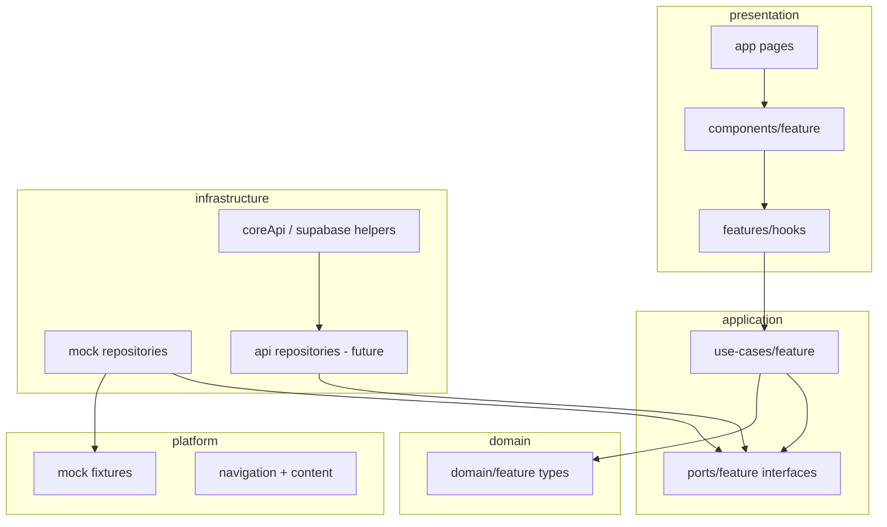

# Zenformed consuming-app architecture standard

**Status:** Reference standard for BuildCore, ForgeCore, and future Zenformed consuming apps.

**Last updated:** 2026-05-16

This document defines how **Next.js consuming apps** structure product code, connect to backend data, and share UI with `@zenformed/core` — without duplicating platform concerns in every app.

**Related:** [PROGRESS.md](./PROGRESS.md) · [CRM_BACKEND_PLAN.md](./CRM_BACKEND_PLAN.md) (BuildCore CRM backend, paused)

---

## 1. Layer responsibilities

| Layer | Path | Responsibility |
|-------|------|----------------|
| **Domain** | `src/domain/<feature>/` or `src/domain/entities/` | App-specific types, enums, pure helpers. No React, no `fetch`, no Supabase. |
| **Application ports** | `src/application/ports/<feature>/` | Interfaces the app needs from the outside world (repositories, auth, entitlement readers). |
| **Application use cases** | `src/application/use-cases/<feature>/` | One action per module: list projects, get by slug, sign in. Orchestrate ports; no UI. |
| **Infrastructure** | `src/infrastructure/<feature>/` | **Backend adapters:** repository implementations, Supabase/Core HTTP clients, auth adapters, config. |
| **Presentation features** | `src/presentation/features/<feature>/` | Hooks, view models, formatters — wire use cases to UI state. |
| **Presentation components** | `src/presentation/components/<feature>/` | React UI only; receive data via props from features/pages. |
| **Presentation (shared)** | `src/presentation/providers/`, `hooks/`, `components/SaaSAuth/` | Cross-feature shell: auth gate, theme, tenant, profile. |
| **Platform** | `src/platform/` | App definition, navigation labels/routes, copy/content, icons — **not** business persistence. |
| **App router** | `app/` | Next.js routes, **BFF** API routes (`app/api/`), thin page files that compose presentation. |
| **Composition root** | `src/shared/di/` | Wire concrete adapters to use cases / repository factories (small, explicit). |

**Dependency rule (inward only):**

```
app/ → presentation → application → domain
              ↓
        infrastructure (implements application ports)
```

Presentation must **not** import `platform/mock/*` or Supabase directly for product data. Platform relays (`app/api/internal/*`) are the exception for ZenformedCore profile/entitlement.

---

## 2. Where backend / API connection code belongs

| Concern | Belongs in | Example |
|---------|------------|---------|
| SQL / Supabase queries | `infrastructure/<feature>/` | `SupabaseCrmProjectsRepository` |
| HTTP to ZenformedCore (server) | `infrastructure/coreApi/` | `organizationBrandingClient.ts` |
| Browser → app BFF | `app/api/<area>/route.ts` | Thin relay; calls infrastructure |
| Repository factory / data source switch | `infrastructure/<feature>/` + `infrastructure/config/` | `getCrmRepositories()`, `getCrmDataSource()` |
| Domain mapping (DB row → type) | `infrastructure/<feature>/mappers/` | snake_case ↔ `CrmProjectSummary` |
| **Not** in components/hooks | — | No `fetch` in `CrmProjectsTable.tsx` |

**BFF pattern (all consuming apps):**

```
Browser → app/api/* (BuildCore/ForgeCore Next server) → Supabase or ZenformedCore HTTP
```

Browser holds Supabase session; BFF validates Bearer token server-side (see existing `users-me-profile` routes).

---

## 3. What “managers” map to now

In older projects, a **manager** folder often meant: *load/save entities, call APIs, cache, coordinate updates.*

In Zenformed consuming apps, split that responsibility:

| Old “manager” concern | Modern location |
|----------------------|-----------------|
| API / DB calls | `infrastructure/<feature>/` repository or provider class |
| Interface consumed by UI | `application/ports/<feature>/` |
| “Load all projects” action | `application/use-cases/<feature>/` |
| React state + filtering | `presentation/features/<feature>/` hook or view model |
| Singleton / which implementation is active | `infrastructure/.../factory` + `src/shared/di/container.ts` |

**Do not** add a new top-level `managers/` folder. Use **ports + infrastructure adapters + use cases**.

**ForgeCore equivalent:** `IDataProvider` + `infrastructure/data-providers/*` (SQL, Excel, ERP) + `DataProviderFactory` + use cases like `ListWorkOrders`.

**BuildCore equivalent:** `ICrmProjectsRepository`, etc. + `infrastructure/crm/mock/*` + `getCrmRepositories()` + `listCrmProjectSummaries`.

---

## 4. Mock data isolation

| Location | Purpose |
|----------|---------|
| `src/platform/mock/<feature>/` | Static fixtures, builders, seed-shaped JSON/TS **only** |
| `src/infrastructure/<feature>/mock/` | Classes that implement ports by reading fixtures |
| `src/infrastructure/config/` | `NEXT_PUBLIC_*_DATA_SOURCE=mock\|api` |

**Rules:**

1. `platform/mock` exports fixtures — **no** React, no interfaces required (builders OK).
2. Only **infrastructure mock repositories** import `platform/mock`.
3. Hooks import **use cases** + composition root — never `MOCK_*` constants.
4. UI behavior stays identical when swapping mock → API at the factory.

BuildCore today: `platform/mock/crm` → `infrastructure/crm/mock/MockCrmRepositories.ts` → use cases → hooks. ✅

---

## 5. Replacing mock repositories with API repositories

1. Implement `ApiCrmProjectsRepository` (etc.) in `infrastructure/crm/api/` using `fetch('/api/crm/...')` **server-side** or from BFF-called modules — keep browser on BFF, not raw Supabase for CRM.
2. Extend `getCrmRepositories()` (or `createCrmRepositories()`) to branch on `getCrmDataSource()`:
   - `mock` → existing mock classes
   - `api` → API repository classes
3. Mappers return the **same domain types** (`CrmProjectDetail`, not raw DTOs in UI).
4. Hooks may gain async loading later; use cases can return `Promise` without changing component props contracts.

No UI import changes if domain shapes stay stable.

---

## 6. `@zenformed/core` vs consuming app

| `@zenformed/core` (shared package) | Consuming app |
|-----------------------------------|---------------|
| SaaS auth reaction helpers (`resolveSaasProfileAuthReaction`, …) | App-specific `SaaSProfileProvider` wiring |
| Entitlement snapshot types/readers | App BFF relays to ZenformedCore |
| `dashboard-shell` layout primitives (sidebar row, branding slot, page loading) | App sidebar content, routes, feature tables |
| Browser Supabase client singleton helper | App `storageKey`, env, gates |
| Generic utilities (no CRM/WorkOrder types) | All product domain under `src/domain/` |

**Never** put BuildCore CRM types, ForgeCore work-order tables, or app-specific copy in `@zenformed/core` unless **three or more** apps need the same abstraction.

**ZenformedCore (hosted API)** owns: app registry, entitlements, org profile relay targets, platform capability tables — not CRM projects or work orders.

---

## 7. Avoiding double-coding between apps

| Share once | Keep per app |
|------------|--------------|
| Auth/session UX patterns (copy from ForgeCore → BuildCore) | Domain models (`domain/crm` vs `domain/entities/WorkOrder`) |
| Dashboard shell CSS class picking via `pickDashboardLayoutClassNames` | Navigation (`platform/navigation/*`) |
| BFF relay **pattern** (auth header, error mapping) | BFF **routes** and payloads |
| Entitlement gate components (via core + shared SaaSAuth structure) | Feature components and use cases |

When two apps need the same **product** behavior (unlikely for CRM vs job board), extract to `@zenformed/core` only after the second implementation proves the API.

Prefer **documented patterns** (this file) over premature shared packages.

---

## 8. App-specific navigation vs shared shell UI

| Shared shell (`@zenformed/core/dashboard-shell`) | App-specific (`src/platform/navigation/`) |
|--------------------------------------------------|---------------------------------------------|
| Layout grid, sidebar column, main scroll region | Route paths (`/dashboard`, `/projects/[slug]`) |
| Branding circle slot, settings drawer chrome | Sidebar item ids, labels, titles |
| Header account menu structure | Search placeholder, “new project” aria labels |
| Page loading overlay | Which nav item is active |

**Content/copy:** `src/platform/content/<app>DashboardContent.ts` — all user-visible strings for the shell and features.

**Pages:** `app/(dashboard)/.../page.tsx` stay thin; import presentation components only.

---

## 9. How future apps should adopt this pattern

1. Copy **folder skeleton** from BuildCore or ForgeCore (not the feature code).
2. Add `src/platform/appDefinitions/<app>.json` + manifest registration on ZenformedCore.
3. Implement auth path first (Supabase + `SaaSProfileProvider` + BFF profile relay).
4. Add **domain** types for the app’s main aggregate.
5. Add **ports** + **mock infrastructure** + **use cases** before any migration.
6. Build **presentation/features** hooks that call use cases.
7. Add **BFF + Supabase** only when mock → api swap is planned.
8. Set `NEXT_PUBLIC_<APP>_DATA_SOURCE` or shared `CRM_DATA_SOURCE`-style flag per feature.

**ZenformedTestApp:** When present in the monorepo, it should follow this same layout for any sample feature (minimal domain + mock repo + one hook). It is not a second source of patterns.

---

## 10. BuildCore CRM alignment checklist

BuildCore Phase 6 introduced the CRM repository layer. Compared to this standard:

| Standard | BuildCore status |
|----------|------------------|
| `domain/crm/` types | ✅ |
| `application/ports/crm/` | ✅ |
| `application/use-cases/crm/` | ✅ (list + get detail) |
| `infrastructure/crm/mock/` | ✅ |
| `platform/mock/crm` fixtures only | ✅ (only infra imports) |
| Factory `getCrmRepositories()` + data source config | ✅ |
| Hooks → use cases (not mock) | ✅ |
| Composition root wires CRM | ✅ (`shared/di/container.ts`) |
| Sub-repos (workflow, documents, …) | ✅ defined; detail still loads via aggregate (OK for v1) |

### Minor deviations (fix before Phase 7 DB/API — optional polish)

| Item | Recommendation |
|------|----------------|
| ForgeCore uses `domain/entities/`; BuildCore uses `domain/crm/` | **OK** — prefer `<feature>` folders for large product areas |
| ForgeCore generic `IDataProvider`; BuildCore feature repositories | **OK** — CRM is multi-entity; explicit repos are clearer than one mega-provider |
| `presentation/hooks/` vs `presentation/features/*/hooks` | BuildCore CRM hooks live under `features/` ✅; global auth hooks in `presentation/hooks/` ✅ (matches ForgeCore) |
| Detail page still reads full `CrmProjectDetail` aggregate | **OK** until lazy-loaded panels need sub-repos from hooks |

### Do not do before Phase 7

- CRM Supabase migrations or `/api/crm` routes (per pause).
- Moving CRM UI into `@zenformed/core`.
- Inline table editing or create drawer (UI phases).

---

## Quick reference diagram



---

## Reference implementations

| App | Data integration pattern | Feature example |
|-----|-------------------------|-----------------|
| **ForgeCore** | `IDataProvider` + `DataProviderFactory` | Work orders |
| **BuildCore** | `CrmRepositories` + `getCrmRepositories()` | CRM projects |

Both conform to the same layer rules; naming differs by product shape, not by architecture tier.
